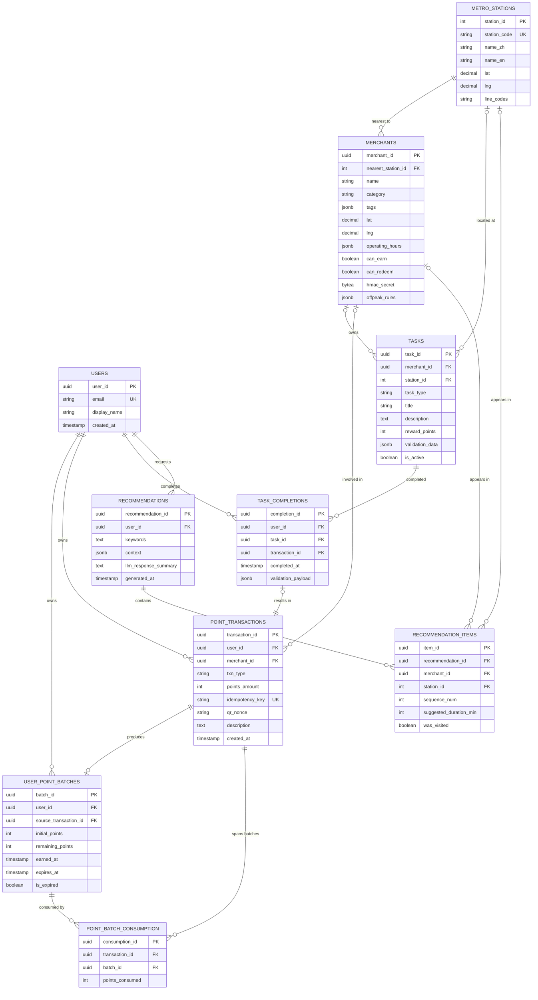

```mermaid
erDiagram
    USERS ||--o{ USER_POINT_BATCHES : owns
    USERS ||--o{ POINT_TRANSACTIONS : owns
    USERS ||--o{ TASK_COMPLETIONS : completes
    USERS ||--o{ RECOMMENDATIONS : requests

    METRO_STATIONS ||--o{ MERCHANTS : "nearest to"
    METRO_STATIONS |o--o{ TASKS : "located at"
    METRO_STATIONS |o--o{ RECOMMENDATION_ITEMS : "appears in"

    MERCHANTS |o--o{ TASKS : owns
    MERCHANTS |o--o{ POINT_TRANSACTIONS : "involved in"
    MERCHANTS |o--o{ RECOMMENDATION_ITEMS : "appears in"

    TASKS ||--o{ TASK_COMPLETIONS : completed

    POINT_TRANSACTIONS ||--o| USER_POINT_BATCHES : produces
    POINT_TRANSACTIONS ||--o{ POINT_BATCH_CONSUMPTION : "spans batches"
    USER_POINT_BATCHES ||--o{ POINT_BATCH_CONSUMPTION : "consumed by"
    TASK_COMPLETIONS o|--|| POINT_TRANSACTIONS : "results in"

    RECOMMENDATIONS ||--o{ RECOMMENDATION_ITEMS : contains

    USERS {
        uuid user_id PK
        string email UK
        string display_name
        timestamp created_at
    }

    METRO_STATIONS {
        int station_id PK
        string station_code UK
        string name_zh
        string name_en
        decimal lat
        decimal lng
        string line_codes
    }

    MERCHANTS {
        uuid merchant_id PK
        int nearest_station_id FK
        string name
        string category
        jsonb tags
        decimal lat
        decimal lng
        jsonb operating_hours
        boolean can_earn
        boolean can_redeem
        bytea hmac_secret
        jsonb offpeak_rules
    }

    TASKS {
        uuid task_id PK
        uuid merchant_id FK
        int station_id FK
        string task_type
        string title
        text description
        int reward_points
        jsonb validation_data
        boolean is_active
    }

    USER_POINT_BATCHES {
        uuid batch_id PK
        uuid user_id FK
        uuid source_transaction_id FK
        int initial_points
        int remaining_points
        timestamp earned_at
        timestamp expires_at
        boolean is_expired
    }

    POINT_TRANSACTIONS {
        uuid transaction_id PK
        uuid user_id FK
        uuid merchant_id FK
        string txn_type
        int points_amount
        string idempotency_key UK
        string qr_nonce
        text description
        timestamp created_at
    }

    POINT_BATCH_CONSUMPTION {
        uuid consumption_id PK
        uuid transaction_id FK
        uuid batch_id FK
        int points_consumed
    }

    TASK_COMPLETIONS {
        uuid completion_id PK
        uuid user_id FK
        uuid task_id FK
        uuid transaction_id FK
        timestamp completed_at
        jsonb validation_payload
    }

    RECOMMENDATIONS {
        uuid recommendation_id PK
        uuid user_id FK
        text keywords
        jsonb context
        text llm_response_summary
        timestamp generated_at
    }

    RECOMMENDATION_ITEMS {
        uuid item_id PK
        uuid recommendation_id FK
        uuid merchant_id FK
        int station_id FK
        int sequence_num
        int suggested_duration_min
        boolean was_visited
    }
```
